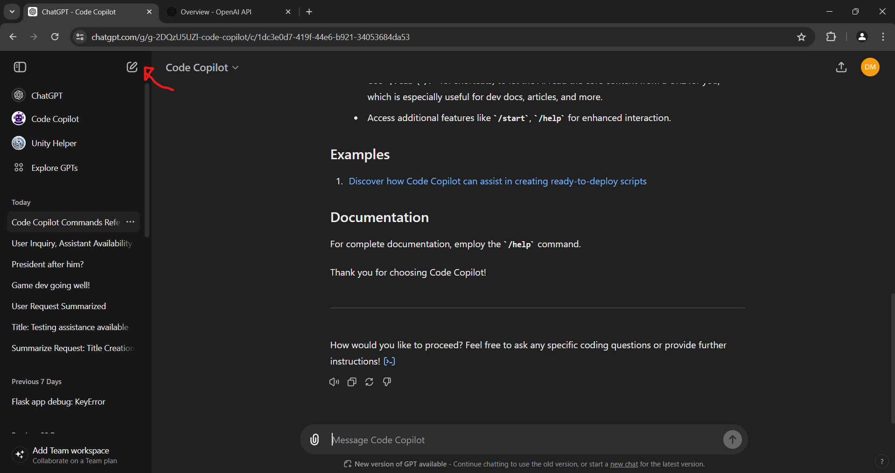
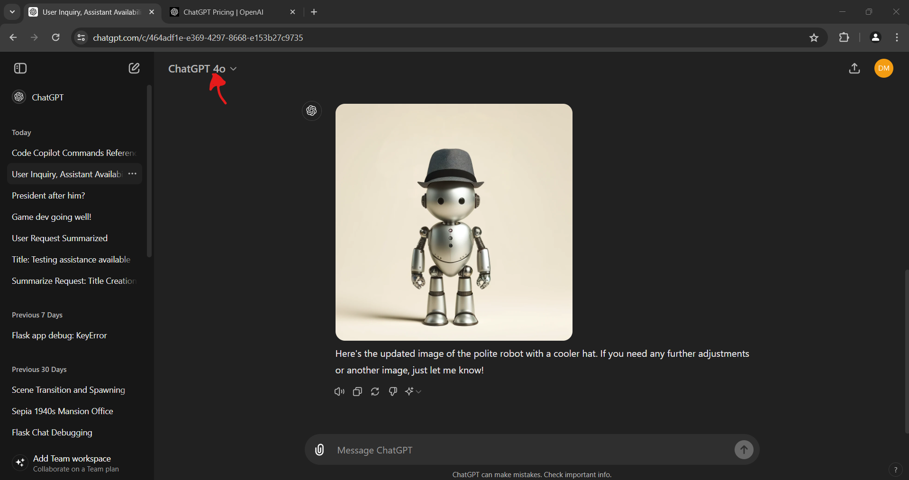
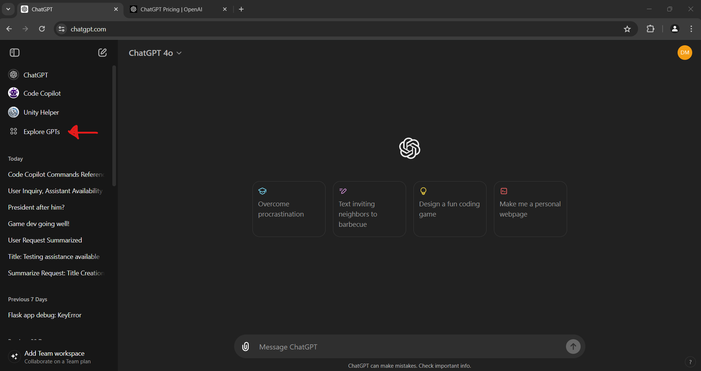

# Lab 1: OpenAI Introduction and Setup
Welcome!

This lab series is designed to serve as a companion guide to official [OpenAI documentation](https://platform.openai.com/docs/overview) for those who are interested in exploring OpenAI for the first time. As the labs progress we'll learn about chat completion, prompt engineering, image creation, and work towards creating a custom app that utilizes the openAI API. 

This first lab is designed as your introduction to OpenAI's system and its various offerings. We'll go over the setup of how you can start accessing some of these tools as well as some basics concepts and tips. We'll also go briefly go over prompt engineering, how we can be better prompt engineers and some key considerations for getting more pointed results.

## Prerequisites
* None

## Setup
OpenAI's offerings as a platform are vast. Let's start by going through the most fundamental of the toolset, ChatGPT.

If you don't already have an OpenAI account, click [here](https://openai.com/) and set one up

Note: For the rest of this lab we will be using a plus subscription to OpenAI. If you don't have access to a premium subscription, you are still able to use the ChatGPT 3.5 model for free, in which case you can still take note of some of our tips for chat completion prompt engineering.

If you'd like to sign up for a plus account, sign up [here](https://openai.com/chatgpt/pricing/)

Please also note that a subscription to ChatGPT plus does _NOT_ include any tokens to be used in the API. For all intents and purposes, they are separate services that are used and paid for independently but can be accessed via the same login.

## Introduction
Once you are logged in, you'll have the option of navigating to ChatGPT or the OpenAI API. Let's stick to ChatGPT for now.

Now that you're in, let's start with a basic chat. On the left is all of our chat sessions. Hovering over them, we can export them for sharing, give them specific names for easily finding them later or delete them.

Lets create a new chat by clicking next to the ChatGPT button at the top left.

After creating a new chat, we can choose our model located at the top left. We'll get into models later, but for now let's select "GPT-3.5". Try asking ChatGPT for the answer to a question that you know the answer to in the "Message ChatGPT" prompt window.

Did it give you an expected answer back? Great! If not, we'll get into how to get more expected responses later in the lab.

Next, let's try telling ChatGPT something that we want it to remember. For instance, "My name is Fred". After it responds, let's ask it "What is my name?" Note that the bot responds with the name we told it before. This is because ChatGPT has built-in chat memory that it can utilize to help it answer prompts. This can be very useful for continuous workflows with a bot as you change things on the fly or are just looking for a a back and forth conversation. 

Note that these chats, as well as any chats you create with the service have a session-based memory. This means that any time you create a new session, all history will be reserved to that session and won't be accessed by any other session that was or will be created.

## Prompt Engineering
Great! So we have the basics down, but we'd like to extend our functionality a bit. How can we do that with just text?

Prompt engineering is the process of shaping a prompt to elicit desired responses. It's not unlike phrasing a question differently depending on who you are speaking to. The process for prompt engineering is simply adjusting the wording, structure or context of the prompt. The more fine-tuned your prompt is, the more consistent of results you can expect.

It's important to remember that when we distill ChatGPT down to its most basic form, it's not much more than the predictive text you would find on other apps like sms or google. When you ask it a question about something complex, it is _not_ understanding the concepts required to form an opinion on that subject, it is predicting the answer you want it to give you and giving it to you based off of a huge database of potential resources to pull from. We're not teaching it how to do anything, nor is it learning how to do anything on its own (at least we hope!), it's just really good at finding answers to questions and reshaping those answers to fit a more specific prompt.

Let's create a new session.
Ask a pointed question again, but this time lets define some _intent_.
For instance if our first prompt was:
    What is the capital of Nevada?

Let's try a new prompt like so:
    Respond as though you are Batman. What is the capital of Nevada?

Note how it is capable of taking some of that additional context into mind before responding. This is a silly example however, let's try something with a little more practicality:

    You are a professional .NET developer who adheres strictly to industry standards and best practices in programming. Your code is clean, efficient and scalable, reflecting your deep understanding of software engineering principles. Follow these rules as you provide expert insight:
        1. Offer clear and concise explanations
        2. Ensure your responses are relevant and actionable for .NET development challenges
        3. Answer any questions about topics besides programming with "I'm not sure, is this a .NET question?"
    Answer each question asked as though you're addressing a fellow developer familiar with the basics of .NET programming.

    Question: Can you help me write a .NET controller endpoint that returns "Hello, World"?

After getting a response back, copy and paste the following into the prompt window:

    You are a professional .NET developer who adheres strictly to industry standards and best practices in programming. Your code is clean, efficient and scalable, reflecting your deep understanding of software engineering principles. Follow these rules as you provide expert insight:
        1. Offer clear and concise explanations
        2. Ensure your responses are relevant and actionable for .NET development challenges
        3. Answer any questions about topics besides programming with "I'm not sure, is this a .NET question?"
    Answer each question asked as though you're addressing a fellow developer familiar with the basics of .NET programming.

    Question: What is the capital of Nevada?

You can see how quickly this can grow in complexity. 

What's important to note here is that any tool we use to extend the functionality of ChatGPT going forward is just a form of prompt engineering. Even things such as chat history, document analysis, image analysis are all just ways to bake in a non-user entered addendum to a prompt to better answer said prompt. 

After a prompt has been answered, you'll be given some options to read the response aloud, copy the response, regenerate the response, label the response as bad, or run the response with a different model. Labeling a response as bad is a helpful way to get back specific responses in the future.

[Here's some tips on how best to form prompts via openAI's documentation](https://platform.openai.com/docs/guides/prompt-engineering/six-strategies-for-getting-better-results)

There have also been, and will continue to be for some time, a number of studies done on the efficacy of certain verbiage used and format of prompts and their consistency in getting expected results back. Many people will swear by certain practices or adopt certain habits and some may be more worthwhile than others but ultimately it is (currently) not an exact science. I greatly suggest looking into some of these studies and forming an opinion for yourself based on a variety of different sources. I recommend the ones that provide code examples.

## Using different models
https://platform.openai.com/docs/models/overview

There are a number of models offered as part of the OpenAI API as well as exposed through ChatGPT. Be sure to review some of the options using the link above! We'll be going over some of these models in lab3, but for now take note of the different chat completion models. If you have a plus subscription to ChatGPT, try some of them out and see how their responses differ. Here is where you can change the model:

## Custom GPTs
ChatGPT Plus also gives you the option to use community-made versions of ChatGPT that come with some added customization.

Click on the "Explore GPTs" button and try out some custom versions. 

There are a lot of versions available, so try and choose one that has a ues case you are familiar with and test it out.

Now, let's add our own:

Navigate to the "Create GPT" button at the top right.

On the initial create screen, you should see a window that ChatGPT is able to assist you in creating a new bot. 
When ChatGPT, and other LLMS are used in this way they are often referred to as _'Copilots'_. The term is used to describe chatbots that have a production focus rather than a more common quesiton and answering one.

Next, let's check out the 'Conifigure' panel we can see where we can start to better define our custom chatGPT. Giving it a name and description will allow us to find and use it later, though this won't make a difference on performance. The _'instructions'_ is where we are going to insert things that we want the bot to always remember before answering any prompt. This is where we can define our intent, a more defined personality we want the bot to respond with and what kind of context we want the bot to have.

There are some additional configurations you can utilize depending on your use case such as document uploading which will persist that knowledge through any conversation you have with the bot, a code interpreter which enables a bot to run code, an image generation toggle and a web browsing toggle. 

The next most important aspect of the configuration is custom [actions](https://platform.openai.com/docs/actions/introduction).
Actions allow our custom GPT to extend the functionality of our bot to do more than answering prompts. We'll be taking a look at actions in lab 3.

Note that any custom chatGPT created is NOT private and as such you shouldn't use any confidential information at any point.